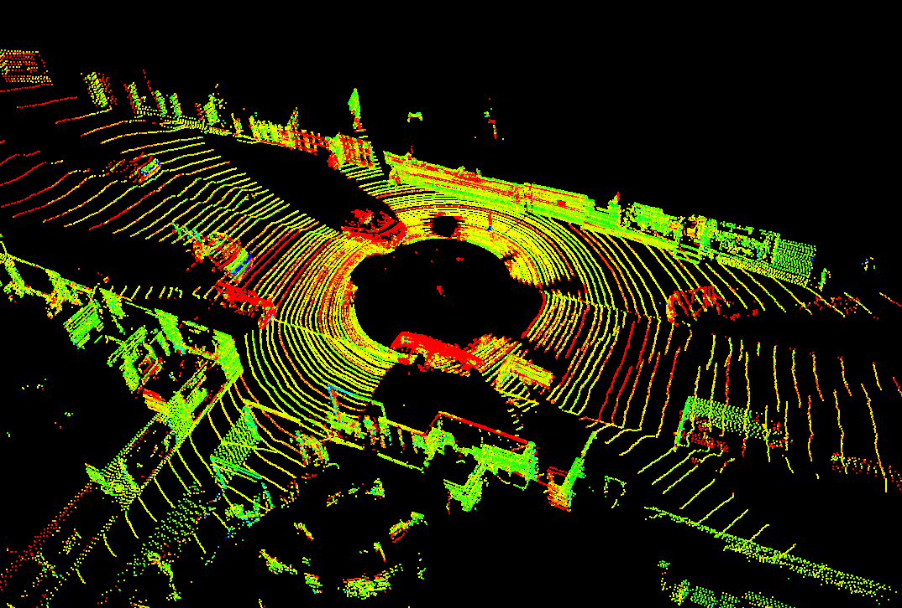
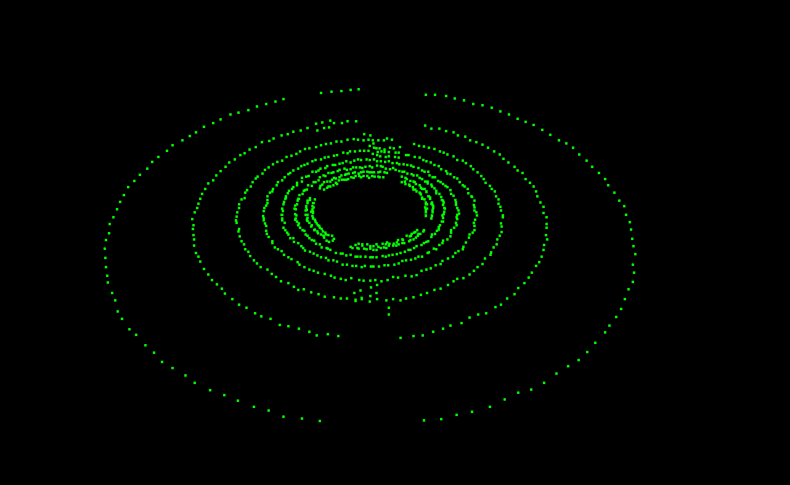
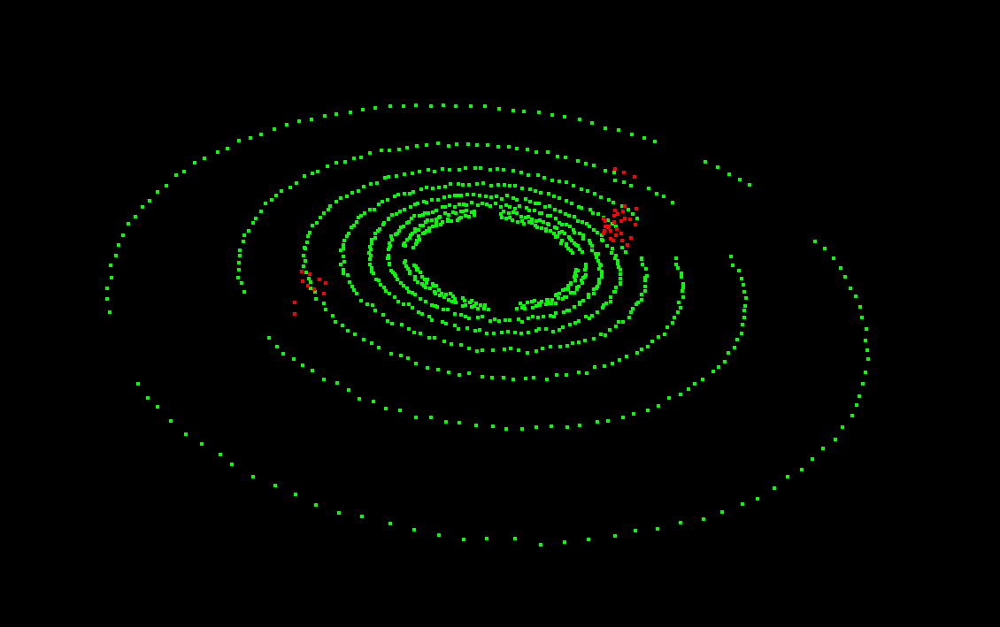
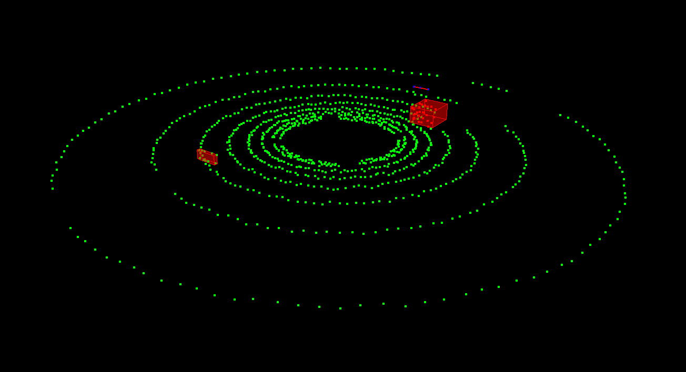
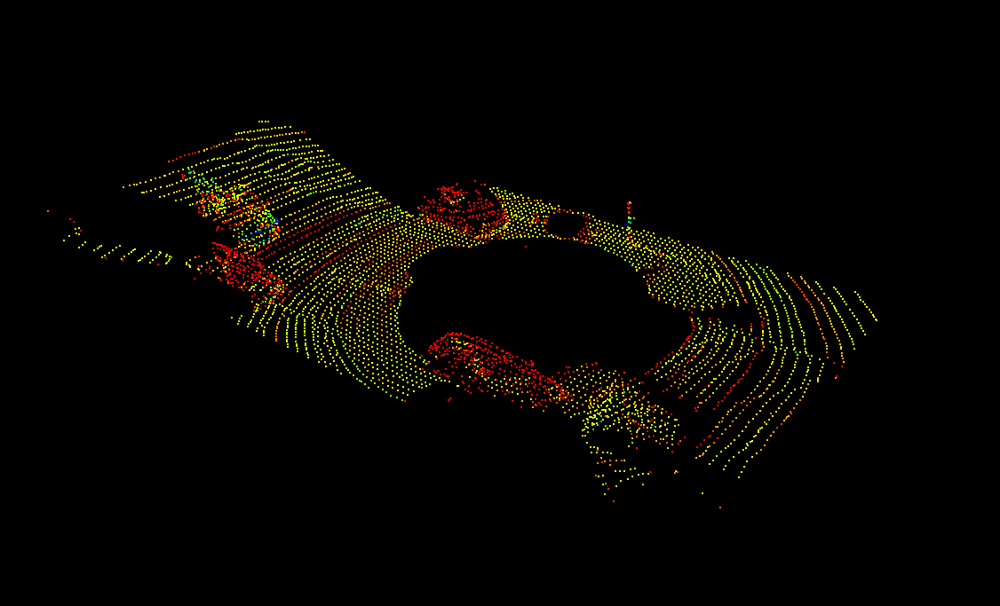

# LIDAR_Obstacle_Detection
**Lidar** Sensor is one of the crucial sensors in state-of-the-art autonomous vehicles. A high-resolution point cloud data of the scene surrounding the vehicle can be visualized using **Lidar**. In this project, Segmentation, Clustering, Downsampling and Filtering have been performed on real time point cloud data which can be seen below,

## Lidar
* Lidar sends out beams of light(lasers) and measures how long it takes for them to come back and thus calculates the distance of the object.
* Lasers will be sent out in many different angles and the range is determined by lidar's field of view.
* Once the laser bounces of materials, the laser intensity value is also received which can be used to evaluate the properties of the material.

## Point Cloud Data
* Lidar data is stored in a format called Point Cloud Data. 
* Each .pcd file consists of a list of (X, Y, Z) or (X, Y, Z, I) coordinates. I in (X, Y, Z, I) refers to the laser Intensity value.

## Project Description
The project mainly consists of four parts.
* Obtaining Point Cloud Data from the **Lidar** scan.
* Point Cloud Segmentation.
* Point Cloud Clustering.
* Point Cloud Filtering.

## Lidar Scan
* In this project, the lidar is represented in a simulator. It does ray casting to sense its surroundings.
* Both horizontal and the vertical resolution of lidar is controlled by the lidar parameters, which can be tweaked to attain high-resolution data.
* The Point Cloud Data of the scene surrounding the vehicle after performing a lidar scan is visualized as below,

## Point Cloud Segmentation
* Point Cloud Segmentation is the process of classifying the point clouds into different regions. In this project, segmentation was performed to classify the points as plane points and non-plane points.
* RANSAC algorithm was implemented from scratch to perform segmentation.
* RANSAC algorithm randomly chooses 3 points to fit a plane and then iterates through all the points of the input cloud to detect inliers.
* RANSAC runs for a maximum number of iterations and then returns the model with the best fit.
* The segmented point cloud is visualized as below,

The red-colored point cloud is referred to as obstacle point cloud and the green-colored point cloud is referred to as plane/road point cloud.

## Point Cloud Clustering
* Point Cloud Clustering is the process of grouping together small clusters of points within a certain distance threshold.
* Euclidean Clustering algorithm was implemented to perform Clustering.
* The clusters that are identified from clustering are bounded by a bounding box and the scene is visualized as below,

## Downsampling Point Cloud Filtering
* Processing high-resolution data is computationally inexpensive and also not required to obtain the proper results. So, the high resolution is often downsampled in such a way that it decreases the computation effort and at the same time doesn't lose any meaningful information.
* point cloud filtering is performed to filter out the point cloud that's unnecessary in getting a result.

The point cloud data before downsampling and filtering is visualized as below,

The point cloud data after downsampling and filtering is visualized as below,

